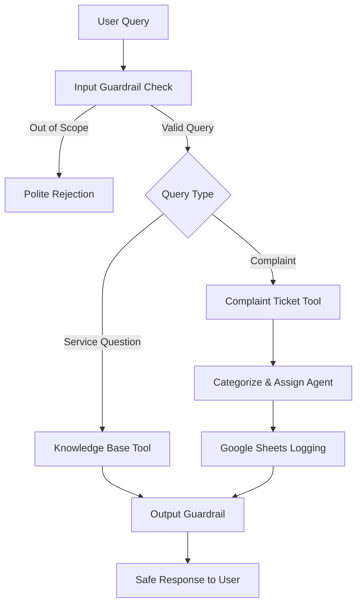

# Customer Support AI Agent - Ethically Safe AI System

🎯 **Objective**: An AI-powered customer support agent that safely handles customer queries, complaints, and service-related questions with built-in ethical guardrails.

## 📋 Project Overview

This project implements a **Customer Support AI Agent** with comprehensive ethical guardrails designed to:
- Handle customer service inquiries safely and professionally
- Process and categorize customer complaints
- Log complaints automatically to Google Sheets
- Ensure all interactions remain within appropriate scope and ethical boundaries

## 🛡️ Ethical Guardrails Design

### Input Guardrails
The system filters incoming requests to:
- **Reject out-of-scope queries** such as:
  - Political discussions
  - Medical advice
  - Harmful or inappropriate requests
  - Personal information requests
- **Validate query relevance** to customer service domain
- **Block potentially harmful content** before processing

### Output Guardrails
All generated responses are ensured to be:
- ✅ Safe and professional in tone
- ✅ Free from bias and harmful content
- ✅ Relevant to customer service context
- ✅ Compliant with business communication standards

## 🔧 Core Agent Architecture

The Customer Support AI Agent is built with **three specialized tools**:

### 1. 📚 Knowledge Base Tool (`knowledge_base_tool`)
Contains comprehensive FAQ information about company services:
- **Internet Packages**: 10 Mbps, 50 Mbps, 100 Mbps plans
- **Business Hours**: 9 AM – 6 PM (Monday to Friday)
- **Refund Policy**: 7-day refund for service downtime issues
- **Service Areas**: Coverage zones and availability
- **Technical Support**: Basic troubleshooting information

**Example Usage**: 
- User: "What internet speeds do you provide?"
- Agent: Fetches package information from knowledge base

### 2. 🎫 Complaint Ticket Tool (`complain_ticket_tool`)
Handles customer complaints with intelligent processing:
- **Automatic Categorization**: Classifies complaints as Low, Medium, or High priority
- **Ticket Generation**: Creates unique complaint IDs
- **Agent Assignment**: Routes complaints to available human agents
- **Data Storage**: Maintains complaint details for tracking

**Available Human Agents**:
- **Rahim** - Technical Issues Specialist
- **Sara** - Billing and Account Manager  
- **John** - General Customer Service Lead

### 3. 📊 Google Sheets Tool (`google_sheet_tool`)
Automatically logs complaint information with:
- Complaint ID (auto-generated)
- User Name
- Complaint Description
- Priority Category (Low/Medium/High)
- Assigned Agent
- Date/Time stamp

## 🔄 System Workflow



### Step-by-Step Process:
1. **User Query** → **Input Guardrail Validation**
2. **FAQ Handling** → Route to `knowledge_base_tool` for service questions
3. **Complaint Processing** → Use `complain_ticket_tool` to categorize and assign
4. **Automatic Logging** → Store complaint details in Google Sheets
5. **User Confirmation** → Provide ticket ID and agent assignment details
6. **Output Guardrail** → Ensure response meets ethical standards

## 💬 Example Conversations

### Service Inquiry Example:
```
👤 User: "What are your internet speed options?"

🤖 Agent: "We offer three internet speed packages:
- 10 Mbps - Basic plan for light browsing
- 50 Mbps - Standard plan for streaming and work
- 100 Mbps - Premium plan for heavy usage and gaming
Would you like more details about any specific package?"
```

### Complaint Handling Example:
```
👤 User: "I've been without internet for 2 days and no one has helped me!"

🤖 Agent: "I sincerely apologize for the service disruption you're experiencing. 
I've logged your complaint as HIGH priority with Ticket ID: CS-2024-001.
Agent Sara has been assigned to your case and will contact you within 2 hours.
You may also be eligible for service credit under our refund policy."
```

### Out-of-Scope Example:
```
👤 User: "What do you think about the current political situation?"

🤖 Agent: "I'm designed to help with customer service inquiries related to our 
internet and technical services. For questions about our services, billing, 
or technical support, I'm here to help! How can I assist you today?"
```

## 🚀 Installation & Setup

### Prerequisites
```bash
pip install -r requirements.txt
```

### Required Dependencies
- `openai` - For AI agent functionality
- `streamlit` - For web interface
- `gspread` - For Google Sheets integration
- `python-dotenv` - For environment variables
- `pandas` - For data handling

### Environment Configuration
Create a `.env` file with:
```env
OPENAI_API_KEY=your_openai_api_key
GOOGLE_SHEETS_CREDENTIALS=path_to_credentials.json
```

### Running the Application
```bash
# Start the Streamlit interface
streamlit run v6_streamlit_agent.py

# Or test the core functionality
python test_env.py
```

## 📊 Google Sheets Integration

**Live Complaint Log**: [Customer Complaints Sheet](https://docs.google.com/spreadsheets/d/your-sheet-id) *(View-only access)*

The sheet automatically updates with:
- Real-time complaint logging
- Priority categorization
- Agent assignment tracking
- Timestamp documentation

## 🧪 Testing & Validation

### Test Scenarios Covered:
- ✅ Valid service inquiries
- ✅ Complaint categorization accuracy
- ✅ Out-of-scope query rejection
- ✅ Google Sheets logging functionality
- ✅ Agent assignment logic
- ✅ Response safety validation

### Running Tests
```bash
python test_env.py
```

## 📁 Project Structure
```
Customer_Support_AI_Agent/
├── README.md                     # This documentation
├── requirements.txt              # Python dependencies
├── test_env.py                  # Testing and validation
├── v5_guardrails_and_context.py # Core guardrails implementation
├── v6_streamlit_agent.py        # Streamlit web interface
└── .env                         # Environment configuration
```

## 🎥 Demo

**[Demo Video Link](your-demo-video-url)** - 3-minute walkthrough showing:
- Agent responding to service inquiries
- Complaint processing and categorization
- Google Sheets automatic logging
- Guardrail functionality in action

## 🔐 Security & Privacy

- All user data is handled according to privacy best practices
- No sensitive information is stored permanently
- Complaint data is anonymized in logs
- Secure API key management

## 🤝 Contributing

This project was developed as part of **Mod 12: Building an Ethically Safe AI Agent** coursework, focusing on responsible AI implementation with comprehensive guardrails.

## 📄 License

This project is for educational purposes as part of AI ethics and safety curriculum.

---

**Built with ❤️ and ethical AI principles**